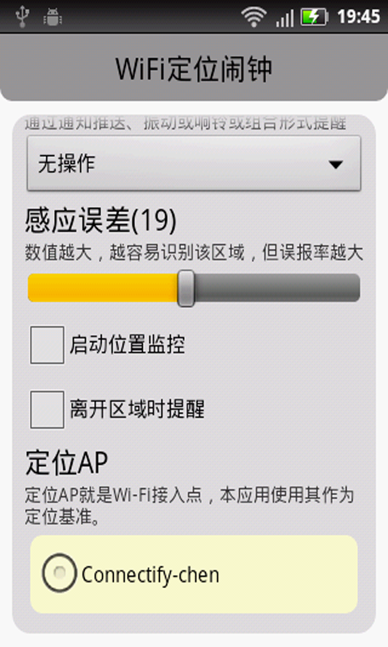

# Indoor positioning technology based on Wi-Fi signal

This app project contains two parts, server and client. 

## Server

The server side is responsible for collecting Wi-Fi data submitted from the mobile client when users are using the app. 

## Client

The client side is a mobile device that runs the app so the app can collect Wi-Fi signal from the phone. 

## Applications

This project contains two applications, WifiClock and WLBS. 

WifiClock is an app that can give reminders to users when the users are in the same wifi locations.

WLBS is a client-server app that can create, build and use Wifi maps for navigation. 

## Screenshot

### WLBS

### WifiClock

